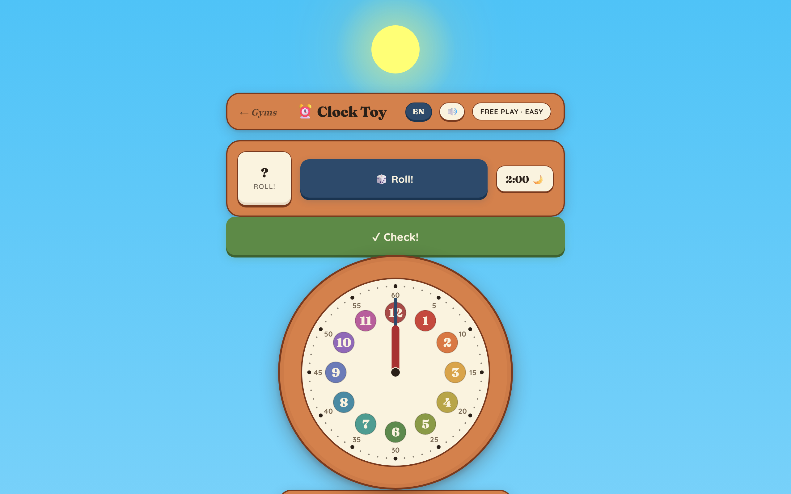
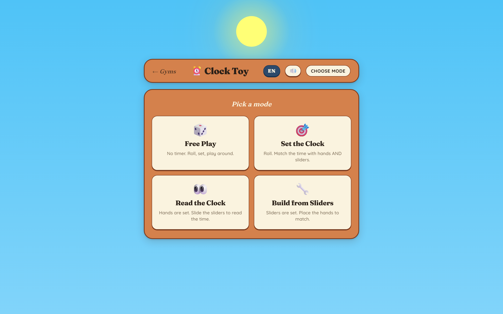
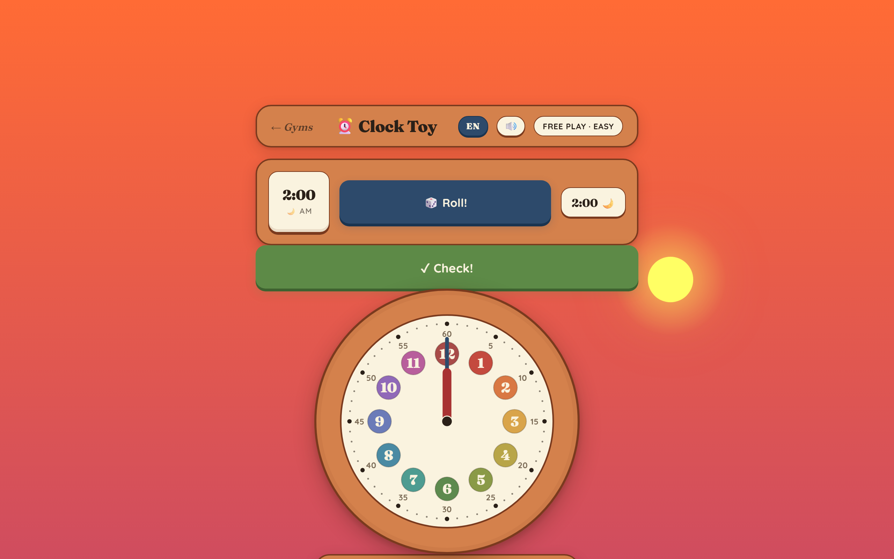
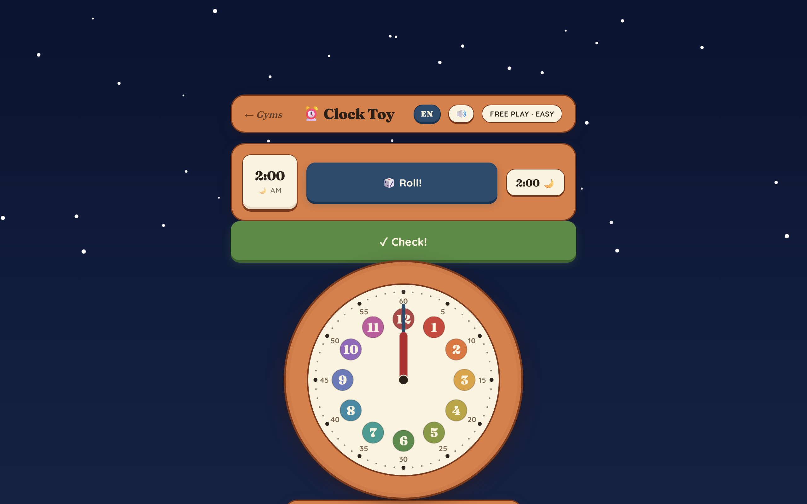
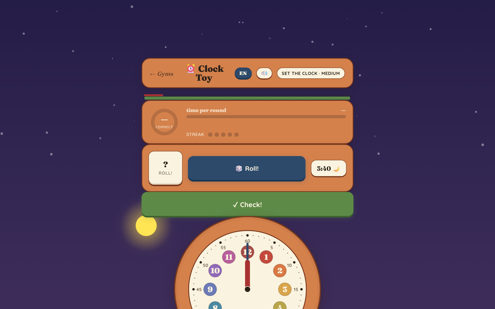
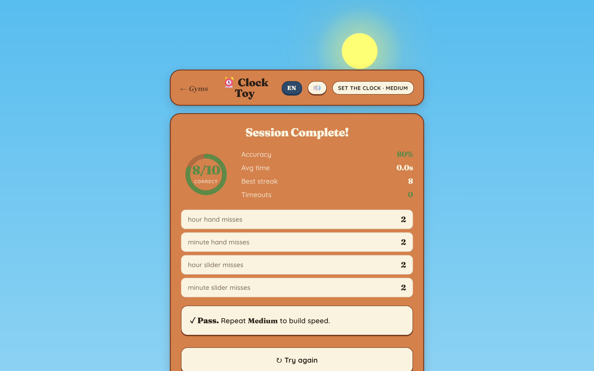
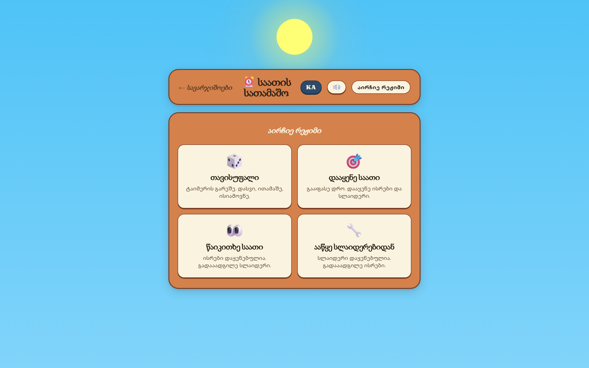
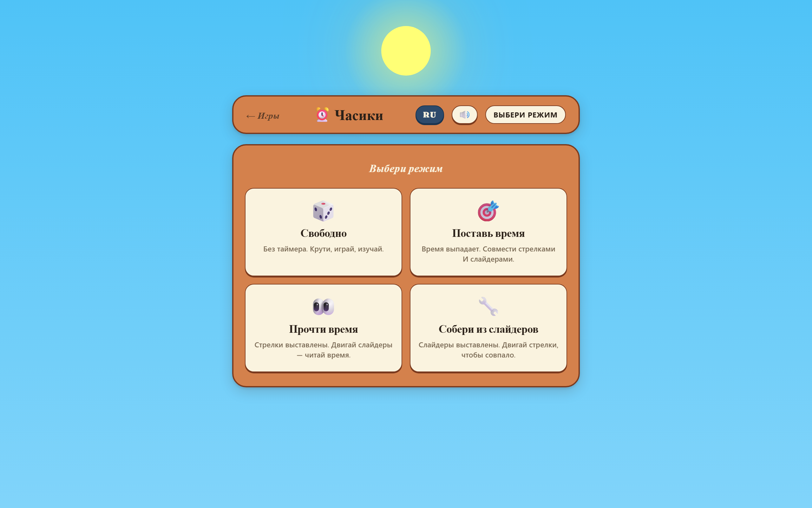

# Clock Toy

A kid-friendly clock-reading practice toy. Drag the hour and minute hands, slide the matching sliders, or both — the two stay in sync. The sky behind the clock walks a real 24-hour orbit: bright sun overhead at noon, deep orange at sunset, stars at midnight.



## What's in it

Four play modes, three difficulties:

|              | Mode                                                         |
| -----------: | ------------------------------------------------------------ |
| **Free Play** | No timer. Roll, drag, watch the sky change. |
| **Set the Clock**     | A target time is rolled. Match it with the hands or the sliders — both follow each other. |
| **Read the Clock**    | The hands are pre-set. Slide to read the time off the clock. |
| **Build from Sliders** | The sliders are pre-set. Drag the hands to match.  |

Difficulties tune the timer length, the minute granularity, and whether the hour hand drifts continuously between hour marks (Hard).

The four-position dot row above the clock tracks accuracy across a 10-round session; a per-round colored timer bar runs alongside it. At the end of the session a summary screen shows accuracy, average time per round, best streak, and a per-input error breakdown.

| Mode picker | Sunset | Midnight |
|-------------|--------|----------|
|  |  |  |

| Drill 1 round | Session summary |
|---------------|-----------------|
|  |  |

## Languages + voice

UI ships in three locales — **English**, **ქართული** (Georgian), **Русский** (Russian) — swappable from the `EN` / `KA` / `RU` pill in the header. The choice persists in `localStorage`.

| English | ქართული | Русский |
|---------|---------|---------|
|  |  |  |

The `🔊` pill toggles voice on/off. When on, the toy speaks the result of each check, the timeout, the drill 2 hint, and the end-of-session verdict in the active language. Audio clips were pre-generated with a local TTS tool (Azure Neural voices for ka/ru/en) and live as static MP3s under `audio/<lang>/`. **No network call at runtime**, no API key, no autoplay surprises — if a clip is missing the game silently no-ops.

## Run it locally

ES-modules need HTTP, so opening `index.html` from disk won't work — use any static server:

```bash
npm run serve         # http-server on :5510
# or
python -m http.server # if you'd rather not touch npm
# or open the directory with VS Code's Live Server extension
```

## Tests

```bash
npm install
npx playwright install chromium    # one-time
npm test                           # ~50 Playwright tests, ~12s
npm run test:ui                    # interactive
npm run test:headed                # watch the browser run
```

The Playwright config spins up `http-server` on port `5510` automatically.

## Regenerate the screenshots

```bash
npm run screenshots
```

Writes six PNGs to `screenshots/` by driving the page through the same mechanism the tests use (`window.__clock`, the global picker functions). Useful when colours, layout, or sky shifts.

## Architecture

`index.html` is the DOM scaffold + CSS. All game logic lives in `src/` as ES modules:

```
src/
  config.js        DIFFICULTIES, HOUR_COLORS, thresholds
  events.js        EventEmitter
  state.js         Store: MODE, DIFF, ROUND, STATE, period, session counters
  storage.js       HistoryStore (Repository over localStorage)
  sky.js           24-hour sky, sun circle, stars
  clock.js         SVG clock + hand drag
  sliders.js       Hour/minute rails + knob drag
  modes/           Strategy: free / drill1 / drill2 / drill3
  round.js         RoundRunner: round lifecycle + timer
  ui/              pickers, feedback, stats, summary
  i18n/            en.js / ka.js / ru.js + t() helper + EventEmitter
  audio.js         Pre-generated MP3 playback, locale-aware
  main.js          Composition root: instantiate modules, wire events
```

Patterns used:
- **Strategy** for the four play modes — adding a new mode is one new file in `src/modes/` + one line in `modes/index.js`. There are no `if (MODE === 'drillX')` branches anywhere else.
- **Observer** — `Store` extends `EventEmitter`. The hour hand and the hour slider mirror each other through `Store.setHandH` / `Store.setSliderH`, both of which emit and respect per-input locks.
- **Repository** — `HistoryStore` hides the JSON + localStorage details from everyone else.

## Quirks worth knowing

- **AM/PM is automatic.** The 12-hour clock face is intrinsically ambiguous (one "12" is both noon and midnight). Free Play tracks the period silently: any time the hour hand crosses the 11 ↔ 12 boundary, the period flips. Two full hand revolutions = one full 24-hour day. There's no toggle — the sky is the feedback.
- **The sun is always on screen.** It walks a true circle around the viewport center: top at noon, right at 6 PM, bottom at midnight (hidden behind the board via `z-index: 0`), left at 6 AM. Its size and glow scale with proximity to noon.
- **Tick labels are `5, 10, 15, … 60`, not `0`.** Intentional — there's an in-toy hint that explains why for drill 2.

## License

MIT — see [LICENSE](LICENSE).
